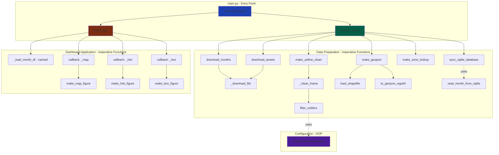

# NYC Taxi Trips Dashboard

**Authors:** Théo Phan, Melchior Laurens
**Project:** ESIEE'S Paris Python course - E4 DSIA class

An interactive dashboard for exploring NYC yellow taxi trip patterns through maps, histograms, and statistical visualizations.

---

## Dashboard Features

The dashboard is a single-page application built with Dash and Plotly. It includes:

1. **Interactive Map**
   - Choropleth map showing metrics by taxi zone
   - Metrics: pickup count, average distance, average fare, average tip
   - Borough filter (Manhattan, Brooklyn, Queens, Bronx, Staten Island)

2. **Histogram**
   - Distribution of trip distance, fare amount, or tip amount
   - Logarithmic or linear scale toggle
   - Range slider for filtering data

3. **Box Plot**
   - Statistical summary grouped by borough
   - Shares the same variable and filters as the histogram

4. **Time Controls**
   - Month slider (fixed at bottom) to explore different time periods
   - All visualizations update synchronously

---

## User Guide

### Prerequisites

- Python 3.13 or higher
- pip package manager

### Installation

1. Clone this repository:
   ```bash
   git clone https://github.com/melchiorlaurens/nyc-taxi-trips.git
   cd nyc-taxi-trips
   ```

2. Create and activate a virtual environment:
   ```bash
   python3 -m venv .venv
   source .venv/bin/activate  # On Windows: .venv\Scripts\activate
   ```

3. Install dependencies:
   ```bash
   pip install -r requirements.txt
   ```

### Running the Dashboard

1. Launch the application:
   ```bash
   python3 main.py
   ```

2. On first run, the script automatically:
   - Downloads taxi trip data for configured months (default: January through September 2025)
   - Downloads taxi zone shapefiles and lookup tables from NYC Taxi and Limousine Commission (TLC)
   - Cleans and processes the data

3. Open your browser and navigate to: **http://127.0.0.1:8050**

### Changing the Time Period

To analyze different months, edit the `DEFAULT_PERIODS` variable in [src/utils/paths.py](src/utils/paths.py):

```python
DEFAULT_PERIODS = [
    (2025, 1),   # January 2025
    (2025, 2),   # February 2025
    # Add more (year, month) tuples as needed
]
```

After changing this, delete the `data/cleaned/` folder and rerun `python3 main.py`.

---

## Data

### Data Sources

All data comes from the NYC Taxi and Limousine Commission (TLC):

**Trip Records:**
- Yellow taxi trip data in Parquet format
- Each month has a separate Parquet file available via direct download URL
- URL template: `https://d37ci6vzurychx.cloudfront.net/trip-data/yellow_tripdata_{YYYY}-{MM}.parquet`
- Example: `https://d37ci6vzurychx.cloudfront.net/trip-data/yellow_tripdata_2025-01.parquet`
- Default configuration: January through September 2025
- Source: [NYC TLC Trip Record Data](https://www.nyc.gov/site/tlc/about/tlc-trip-record-data.page)

**Geographic Data:**
- `taxi_zones.zip`: Shapefile containing NYC taxi zone boundaries (265 zones)
- `taxi_zone_lookup.csv`: Mapping of zone IDs to borough and zone names
- Source: NYC TLC website

### Data Schema

The dashboard uses the following fields from the trip records:

- `tpep_pickup_datetime`: Pickup timestamp
- `PULocationID`: Pickup taxi zone ID (1-265)
- `trip_distance`: Trip distance in miles
- `fare_amount`: Fare amount in USD
- `tip_amount`: Tip amount in USD
- `passenger_count`: Number of passengers

### Data Cleaning

Raw data is automatically cleaned and filtered ([src/utils/clean_data.py](src/utils/clean_data.py)):

**Outlier Removal:**
- Trips with distance > 5,000 miles are removed
- Fares > $10,000 are removed
- Tips > $10,000 are removed

Low outliers are not removed because they might show useful information to organizations such as the TLC to diagnose cancelled trips or faulty meters.

**Other Cleaning:**
- Records missing pickup location ID are dropped
- Invalid/null values in numeric fields are removed
- Pickup datetime is parsed and year-month is extracted

Cleaned data is saved as monthly Parquet files. Processing runs only once per month; subsequent runs reuse existing files unless raw data is updated.

---

## Developer Guide

### Architecture Overview

The codebase follows an **imperative programming** paradigm, structured around functions called from a main program, with minimal object-oriented elements (one Pydantic model for configuration).



**Programming Paradigm:**
- **Imperative:** Functions are organized in modules and called from `main.py`
- **Object-Oriented:** Single Pydantic model `OutlierThresholds` (data validation class)
- **Main Program Flow:** `main.py` calls `ensure_clean()` then `build_app()` then `app.run()`

### Project Structure

```
nyc-taxi-trips/
├── main.py                    # Entry point: data prep + Dash server
├── requirements.txt           # Python dependencies
├── src/
│   ├── components/
│   │   └── figures.py        # Visualization functions (map, histogram, box plot)
│   ├── database/             # SQLite database layer
│   └── utils/
│       ├── paths.py          # File paths and configuration
│       ├── get_data.py       # Data download functions
│       ├── clean_data.py     # Data cleaning pipeline
│       └── common_functions.py  # Shared helper functions (GeoJSON conversion)
├── data/
│   ├── raw/                  # Downloaded raw data
│   ├── cleaned/              # Processed monthly Parquet files
│   └── database/             # SQLite database
├── tests/                    # Unit tests (run with pytest)
├── assets/                   # Static assets
├── background/               # Background images
└── taxi_zones/               # Taxi zone shapefiles
```

### Adding a New Visualization

1. Create your figure function in [src/components/figures.py](src/components/figures.py):
   ```python
   def make_my_chart(df: pd.DataFrame, **kwargs):
       # Your Plotly figure code
       fig = px.scatter(df, x="...", y="...")
       return fig
   ```

2. Add the chart to the layout in [main.py](main.py):
   ```python
   dcc.Graph(id="my-chart", style={"height": "60vh"})
   ```

3. Create a callback to update the chart:
   ```python
   @app.callback(
       Output("my-chart", "figure"),
       Input("month-index", "value")
   )
   def update_my_chart(month_idx):
       # Load data and generate figure
       return make_my_chart(df)
   ```

### Running Tests

Tests are located in the [tests/](tests/) directory and are primarily for development purposes. Run with: `python3 -m pytest`

---

## Analysis Report

Data analysis for months 01/2025 to 09/2025:

Map Analysis

The analysis of the map shows that data doesn't significantly vary for each chosen month.
In a given month:
- Most pickups happen at JFK Airport and in the center of Manhattan (100k+ pickups)
- In Brooklyn, Queens and The Bronx, few hundreds to few thousands pickups happen
- In Staten Island, only dozens of pickups happen
- Average trip distance is in single digits for all boroughs except Staten Island, which has some trips over 10 miles (note the few samples for one month for Staten Island)
- People tip way less in Queens (<$0.3) that in Manhattan $2)

Histogram Analysis:

In a given month:
- Most trips (>500k) are approx. 1 mile long
- Proportion of trips falls down exponentially to ~ 20k trips of 10 miles
- A lot of trips are outliers, for example, hundreds of trips are longer than 50 miles

Box Plot Analysis:

For trip distance and fare amount, Queens comes first with about double the median value of Bronx and Queens, and Staten Island has its median being the middle of Bronx/Brooklyn and Queens. Manhattan has less than half the average value of Bronx and Brooklyn for its average trip distance and fare amount.

People in Staten Island tip more than in other boroughs, and the values vary a lot between months; that can be explained with the low number of trips in Staten Island.
---


## Copyright and Attribution

We declare that the code in this repository was produced by Théo Phan and Melchior Laurens.
Coding agents were used to help during development.
